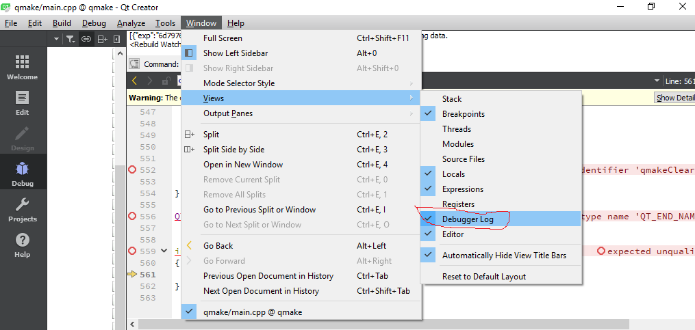
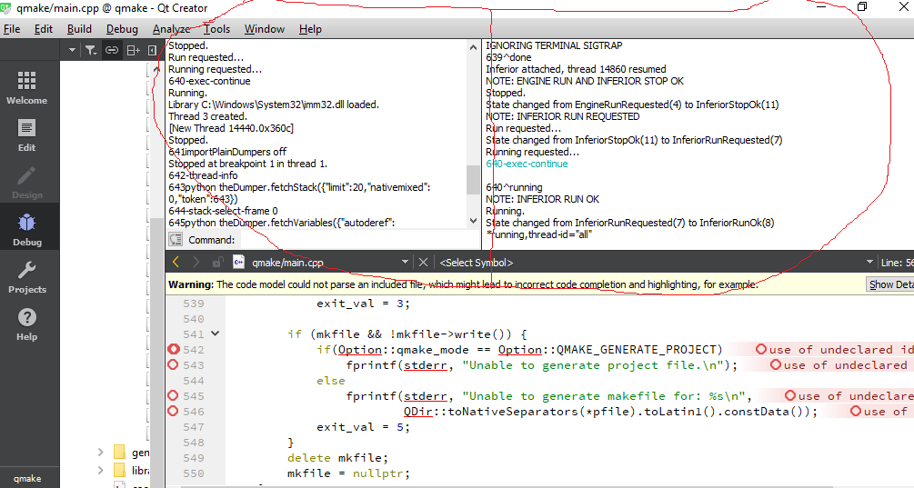
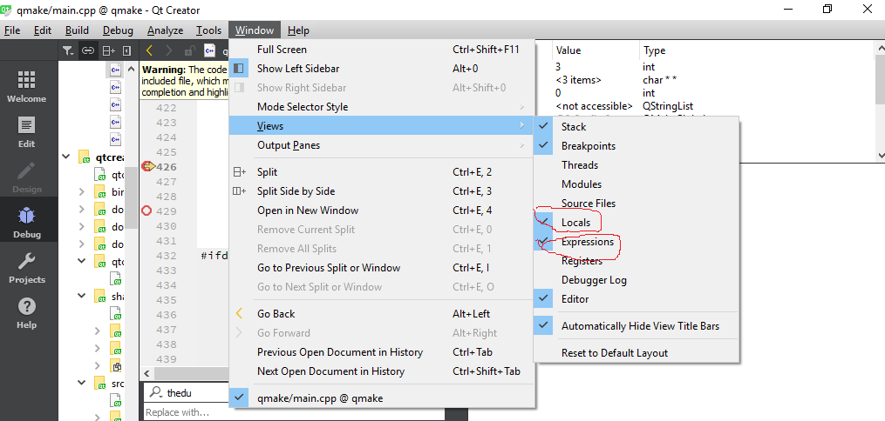

# How does Qt Creator interact with debugger GDB

https://myprogrammingnotes.com/qt-creator-interact-debugger-gdb.html

Type [`info variables`](http://sourceware.org/gdb/current/onlinedocs/gdb/Symbols.html#index-info-variables-918) to list "All global and static variable names".

Type [`info locals`](http://sourceware.org/gdb/current/onlinedocs/gdb/Frame-Info.html#index-info-locals-435) to list "Local variables of current stack frame" (names and values), including static variables in that function.

Type [`info args`](https://sourceware.org/gdb/current/onlinedocs/gdb/Frame-Info.html#index-info-args) to list "Arguments of the current stack frame" (names and values).

You may never notice the interaction between Qt Creator and the GDB debugger in the past. The communication between Qt Creator and GDB is hidden well. You are supposed to only use the variable/watch window during the debug. But sooner or later, you’ll find problems you cannot solve with the debug windows Qt Creator presents to you. For example, you may encounter the problem that [Qt Creator cannot launch the debugger engine](https://myprogrammingnotes.com/unexpected-cdb-exit-cdb-process-terminated.html). Without seeing the logs Qt Creator communicates with the debugger, you’ll never know what’s happening.

There does exist a **debugger log window**. As I said, it is hidden well. If you are lucky, you may see this windows appears in a short time then disappears again when the debugged program exits. It is also impossible for a newbie to dig the debugger window out. In fact, you can let Qt Creator show the debugger log window only when you are debugging a program and by clicking Window/Views/Debugger Log menu item.



Now you will see the debugger log window which has a left panel and a right panel.



From the debugger log window, you can see a lot of interaction messages between Qt Creator and GDB. These are the commands Qt Creator sends to GDB and the results Qt Creator gets from GDB. I hear you are saying “wait a minute, do you mean those lines like *640-exec-continue* *641-thread-info* are the commands sent by Qt Creator to GDB and executed by GDB? I never used those commands. I only used commands like *br*, *list*, *run*, *continue*, *print*, etc to debug a program in GDB.” Yes, you are right, those are not ordinary GDB CLI commands you are using in your daily debugging work, but [GDB MI(Machine oriented text Interface) commands](https://sourceware.org/gdb/onlinedocs/gdb/GDB_002fMI.html). When you start GDB with the -i mi option, as Qt Creator does, you’ll get the commands available for you.

1. gdb -i mi test.exe

The printed messages in the MI mode are very messy because they are not for human readers but for machine parsers. How to decode those inputs and outputs in the debugger log window? Well, the left panel of the debugger log window contains mainly the commands Qt Creator sends to GDB, while the right panel contains both the commands sent and the messages received from GDB. There is a line edit at the bottom of the left panel where you can input debug command(one per time) manually. The MI commands have the form of token-command where token is usually a number. The output of the command will also include the number so the result can be associated with the command easily. But the token can be omitted, for example, *-exec-run*, *-thread-info* are both legal GDB MI commands. Most of the common MI commands have their CLI counterparts. For example, *-exec-run* corresponds to *run*, *-exec-continue* corresponds to *continue.* You can also input ordinary CLI commands in MI mode.

1. (gdb)
2. next
3. &"next\n"
4. ^running
5. *running,thread-id="all"
6. (gdb)

The output of a CLI command will include a line beginning with “&” which is followed by the command you enter. The output in MI mode has special character such as &, ^, *, ~ at the beginning of each line which means the line is from specific output channel. The line beginning with ^ is the final status of the command, i.e., *done*, or *error*. There may be other outputs between the enter of the command and the final status, even after the final status line. These are called out-of-band messages.

The mainly communications between Qt Creator and GDB are not done by calling GDB MI commands, but through [GDB Python API](https://sourceware.org/gdb/onlinedocs/gdb/Python-API.html). The python code is mainly in gdbbridge.py and dumper.py which are in c:\Qt5.12.1\Tools\QtCreator\share\qtcreator\debugger\. Qt Creator will import the gdbbridge python module in GdbEngine::setupEngine() in src\plugins\debugger\gdb\gdbengine.cpp then get the theDumper(of class Dumper) object. With the theDumper python object, Qt Creator can retrieve much information from GDB with the python api. In the setupEngine function, you can also find the commands Qt Creator asks GDB to execute to set the debugger up.

1. show version
2. show debug-file-directory
3. set print object on
4. set breakpoint pending on
5. set print elements 10000
6. set unwindonsignal on
7. set width 0
8. set height 0
9. set substitute-path
10. directory 
11. set sysroot 
12. set detach-on-fork off
13. python sys.path.**insert**(1,"xxxxxx")
14. python sys.path.**append**('xxxxx')
15. python from gdbbridge import *

After the last line, theDumper is available and the first thing Qt Creator uses it to do is to [load the pretty printers](https://myprogrammingnotes.com/qt-pretty-printers.html).

As I said before, the most used debugger windows are the local and the watcher window. If they are not appeared, you can call them out by clicking Window/Views/Locals(Expressions).



The Locals window shows the values of local variables/parameters of a function when execution stops in the function. The watcher window displays the variables you added to watch their values. After breaking on some line in a function, Qt Creator will call theDumper.fetchVariables to retrieve the values of both the local variables and the watched variables in single shot. Here is an example:

1. <682python theDumper.**fetchVariables**({"autoderef":1,"context":"","displaystringlimit":"100","dyntype":1,"expanded":["inspect","local","watch","return"],"fancy":1,"formats":{},"nativemixed":0,"partialvar":"","passexceptions":0,"qobjectnames":1,"resultvarname":"","stringcutoff":"10000","token":682,"typeformats":{},"watchers":[{"exp":"6d7977837273696f6e","iname":"watch.0"}]})

The results are parsed and displayed in the Locals window and the Expressions window, respectively.

Qt Creator calls theDumper.fetchVariables frequently. Even your mouse pointer floats over a variable name in the source code, Qt Creator will call it to retrieve the value of the variable and display it in the popup tool-tip.

In case you want to see the local variables of a calling function use `select-frame` before `info locals`

E.g.:

```c
(gdb) bt
#0  0xfec3c0b5 in _lwp_kill () from /lib/libc.so.1
#1  0xfec36f39 in thr_kill () from /lib/libc.so.1
#2  0xfebe3603 in raise () from /lib/libc.so.1
#3  0xfebc2961 in abort () from /lib/libc.so.1
#4  0xfebc2bef in _assert_c99 () from /lib/libc.so.1
#5  0x08053260 in main (argc=1, argv=0x8047958) at ber.c:480
(gdb) info locals
No symbol table info available.
(gdb) select-frame 5
(gdb) info locals
i = 28
(gdb) 
```